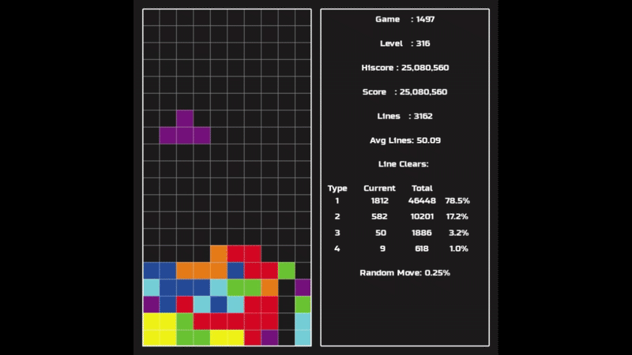

# Tetris AI Project

## **Demo Video**
[](https://www.youtube.com/watch?v=D8MjBG5kSzU)

## **Tetris AI in Action**


## **Genetic Algorithm in Action**


## Overview
This project is an AI-driven Tetris player built using **Python** and **Pygame**. It leverages **Deep Q-Networks (DQN), Double DQN, Prioritized Experience Replay, and Genetic Algorithms** to train an agent that can efficiently play Tetris. The project underwent significant optimizations from **Version 1** to **Version 2** to enhance training speed and efficiency.

## Environment
The game environment follows NES Tetris rules, implementing:
- Scoring system similar to NES Tetris.
- Gravity mechanics for line clears.

The AI interacts with the game through state-based decisions, selecting moves from all possible placements and rotations.

## AI Agent
The initial AI agent was based on **Deep Q-Learning (DQN)**, which uses a **single neural network** to estimate both **current and target Q-values**. However, this approach had issues with **Q-value overestimation** and **early convergence**, leading me to explore improvements.

### Why Q-Learning and DQN?
- Tetris has a **well-defined state space**:  represent the board state using **6 features** (`total_height, bumpiness, holes, line_cleared, y_pos, pillar`).
- The agent **selects only one action per move**, making Q-learning a good fit for evaluating discrete actions efficiently.
- **Experience Replay** helped stabilize learning by allowing the agent to learn from past moves, improving long-term decision-making.
- With this setup, some agents **achieved 500+ lines** by **game 10,000**, demonstrating strong learning potential.

### Transition to Double Q-Learning
- Initially, I implemented **Double Q-Learning**, which **separates action selection from Q-value estimation** to **reduce overestimation bias**.
- This led to more accurate value estimations, improving learning stability.

### Switching to Double DQN (DDQN)
I later adopted **Double DQN (DDQN)**, which expands on Double Q-Learning by using **two separate neural networks**:
- **Primary Network**: Predicts actions and updates **every 200 pieces placed**.
- **Target Network**: Computes target Q-values and updates **every 1000 pieces** to provide more stable training.

This approach **reduces instability** in training, **prevents premature convergence**, and allows the agent to **generalize better across different board states**.

### Prioritized Experience Replay (PER)
Initially, my agent used **Experience Replay**, where past experiences were **randomly sampled** for training. This method helped the agent make **long-term decisions** by allowing it to learn from **past moves**, rather than relying solely on recent experiences.

However, **random sampling treats all experiences equally**, even though some experiences provide **more learning value** than others. To improve this, I implemented **Prioritized Experience Replay (PER).**

#### Why Prioritized Experience Replay?
- Instead of selecting experiences at random, **PER selects experiences based on their TD error** (**Temporal Difference Error**).
- **TD Error = Difference between predicted and actual Q-values**.
  - **High TD Error** → The agent’s prediction was far off, meaning **there’s more to learn from this experience**.
  - **Low TD Error** → The agent already understands this experience well, meaning **less learning value**.

By prioritizing high **TD error** experiences, the agent **learns from its biggest mistakes first**, leading to **faster and more efficient training**—especially in early stages.

#### Implementation of PER
- I replaced the traditional deque-based replay buffer with a **heap-based structure**, allowing efficient retrieval of **high-priority experiences**.
- The heap keeps track of the **maximum TD error**, ensuring that the most **informative experiences are sampled more frequently**.

This approach **significantly improved early training efficiency**, allowing the agent to **focus on valuable experiences** rather than wasting computation on redundant ones.

### Reward Function Design
A well-balanced reward function was necessary to help the agent learn **long-term strategies**. Simply rewarding line clears resulted in poor planning, so I introduced **sparse rewards** to encourage **better board management**.

#### Key Objectives of a Good Board State:
- **Minimal bumpiness** → Smoother surfaces for easier line clears.
- **Minimal holes** → Avoiding trapped empty spaces.
- **Small pillars** → Preventing difficult-to-clear structures.

#### Reward & Penalty System:
- **Penalties for** increasing bumpiness, holes, or large pillars.
- **Punishment for stacking too high** to prevent early game over.
- **Encouragement for moves that improve board stability.**

#### Handling Delayed Rewards (Temporal Credit Assignment Problem)
A good move in Tetris **does not always have an immediate impact**. The agent may place a piece that **sets up a Tetris many moves later**.

- **Short-term rewards** (clearing a single line) might seem optimal, but **setting up for a Tetris (4-line clear) is more valuable**.
- **Experience Replay** helps the agent revisit **earlier moves that contributed to major rewards later**, reinforcing good strategies.
- **Discount Factor (Gamma = 0.999)** ensures that the agent **values long-term rewards**, preventing greed for short-term gains.

By **considering the delayed impact of moves**, the agent learns **how to set up better board states**, instead of focusing only on immediate rewards.

### Exploration vs. Exploitation Strategy
Instead of relying solely on a **typical decay schedule**, I combined it with an **alternating strategy** between **high exploration and high exploitation** in **500-game cycles**. This method **sped up learning while maintaining stability**.

#### High Exploration Phase (500 games)
- **Epsilon:** `0.3 → 0.0001`
- **Learning Rate (LR):** `0.01 → 0.001`
- Since the agent has **10-40 move choices per state**, high exploration **encourages broader strategy discovery**.
- A **higher learning rate (LR)** allows more aggressive updates, helping the agent learn **board setup strategies faster**.

#### High Exploitation Phase (500 games)
- **Epsilon:** `0.0001`
- **Learning Rate (LR):** `0.001`
- The agent **tests its learned strategies** from the exploration phase.
- **Lower LR prevents drastic updates**, refining the strategy without overfitting.
- This phase **stabilizes** the agent's learning, similar to how **stocks correct after a surge**.

#### Second Cycle of Exploration & Exploitation
- **First cycle**: The agent explored **without prior knowledge**.
- **Second cycle**: The agent **explored with refined strategies**, leading to more **targeted discoveries**.
- **Another 500-game exploration phase** allowed for additional improvements.
- **Final exploitation phase** fine-tuned an even better strategy.

This **alternating method** allowed the agent to **learn, refine, explore deeper, and perfect its strategy**.

### Genetic Algorithm (GA)
Balancing the reward function for Tetris AI proved to be **extremely difficult**:
- **Punishing holes too much** led to agents building tall pillars.
- **Punishing pillars too much** made agents cover them too early, avoiding **Tetris clears**.
- **Over-rewarding Tetris clears** made agents stack high and wait for an I-piece, often leading to failure.
- **Under-rewarding Tetris clears** led to single and double line clears, missing higher scores.

Initially, **tuning these rewards required manually adjusting values** and running **500+ games per test**—an impractical and slow process. **Genetic Algorithms (GA)** provided a **brute-force approach** to optimizing these parameters efficiently.

### Evolutionary Strategy
Taking inspiration from **natural selection (survival of the fittest)**, I designed the GA to evolve **the best reward function** by:
- **High exploration early on**, allowing diverse strategies to develop.
- **Gradual transition to exploitation**, refining the best strategies over generations.

Each agent’s performance was measured by its **average number of lines cleared over 500 games**.

### **Selection Process**
We used a **hybrid of elite selection and tournament selection**:
- **Elite Selection (50%)**: The **top 50%** of agents were **directly passed** to the next generation to preserve high-performing strategies.
- **Tournament Selection (50%)**: The remaining 50% were selected **randomly from the top-performing agents**, maintaining diversity.

### **Crossover Strategy**
- **Offspring inherited reward function parameters from parents**.
- **Used a mix of Uniform and Alpha crossover**:
  - **100% uniform crossover in early generations** (high randomness).
  - **Gradually transitioned to 100% alpha crossover by generation 100** (favoring one parent’s values).
  - This **ensured high exploration early on and stable exploitation later**.

### **Mutation Strategy**
- **50% mutation rate early on**, ensuring **diverse strategies**.
- **Gradually decayed to 5% by generation 100**, stabilizing learned behaviors.
- Mutations introduced **small adjustments** to reward parameters, preventing premature convergence.

This **exploration-to-exploitation strategy** allowed me to **discover an optimal balance of rewards**, creating a **highly competitive AI**.

---

## **Optimizations (Version 1 → Version 2)**

- **Version 1:** The project was **not originally designed** to handle multiple game boards in one window. As a workaround, I used **multiprocessing**, giving each agent its **own CPU core**. However, this approach **limited me to 10 agents**, constrained by available CPU processors.  

- **Version 2:** Knowing I wanted **many agents running at once**, I **redesigned the project** to support multiple boards within a single process. This **eliminated the need for multiprocessing**, allowing the computer to efficiently manage tasks internally. Thanks to optimizations, I increased the number of agents from **10 to 250**.

### **Profiling revealed two major bottlenecks**:
1. **Rendering inefficiencies** – Redrawing **static elements** every frame.
2. **State calculation overhead** – Dropping pieces in **all possible positions** consumed excessive time.

### **Rendering Optimizations**
- **Old Approach**: Redrew **every block** in every frame.
- **New Approach**: Used **dirty rects** (only updating changed areas).
  - **Result**: Rendering time reduced from **90s → 5s**.

### **State Calculation Optimizations**
- **Old Approach**: Used **Python loops**, making `calc_all_states()` slow (**~180s**).
- **New Approach**: Rewrote with **Numba’s njit** for **machine code execution**.
  - **Result**: Execution time reduced from **180s → 15s**.

### **Additional Optimizations**
- **Blitting Optimization**: Rendered **directly to the main screen** instead of intermediate surfaces.
- **Batch Processing**: Consolidated **multiple small calculations** into fewer large ones.
- **Reduced Redundant Board Operations**: Minimized **unnecessary board evaluations**.

These optimizations allowed **seamless Genetic Algorithm training**, unlocking **massive scalability improvements**.

---

### **Version 1 Profiling (500 games)**
```plaintext
223807016 function calls (210035110 primitive calls) in 483.520 seconds

Ordered by: cumulative time

ncalls tottime percall cumtime percall filename:lineno(function) 

1        2.155    2.155  481.741  481.741 train.py:85(run_simulation) 
42254    0.305    0.000  206.318    0.005 tetris.py:87(play_full) 
82161    0.575    0.000  205.107    0.002 tetris.py:139(play_step) 
42383   12.129    0.000  180.555    0.004 game.py:203(calc_all_states) 
82160    0.253    0.000  114.913    0.001 game.py:250(run) 
1005317  4.698    0.000  96.764     0.000 game.py:311(hard_drop) 
10562398 16.251   0.000  92.066     0.000 game.py:316(move_down)
```

### **Version 2 Profiling (500 games)**
```plaintext
22190082 function calls (20214157 primitive calls) in 52.530 seconds

Ordered by: cumulative time

ncalls tottime percall cumtime percall filename:lineno(function) 

1        0.423    0.423   50.491   50.491 main_screen.py:155(run2) 
46619    3.519    0.000   20.576    0.000 main_screen.py:113(play_action) 
31/21    0.000    0.000   17.968    0.856 _ops.py:291(fallthrough) 
698733/140673  0.902    0.000   17.785    0.000 module.py:1735(_wrapped_call_impl) 
698733/140673  1.156    0.000   17.579    0.000 module.py:1743(_call_impl) 
139515   1.450    0.000   17.034    0.000 model.py:12(forward)
```

### **Key Takeaways**
- **Total runtime reduced from 483.52s → 52.53s (≈89% speedup)**
- **`calc_all_states()` reduced from 180s → ~15s**
- **Rendering reduced from 90s → ~5s**
- **Overall, training is significantly faster and more scalable.**

---

## **Running the Project**
To run the AI, navigate to the appropriate version and execute:

### **Install requirements**
```bash
pip install -r requirements.txt
```

### **Version 1**
```bash
cd Version1
python -c "import train; train.run_game(True)" # Enable slow drop
python -c "import train; train.run_game(False)" # Disable slow drop
```

### **Version 2**
```bash
cd Version2
python genetic_algo.py
```

